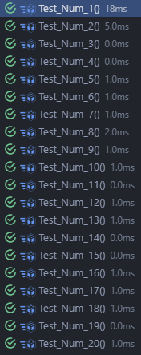

# Memoria Prueba 3 - AIS

| Nombre                         |                            Correo |
| -------------------------------|-----------------------------------|
| Wenhao Zhang                   |     w.zhang.2022@alumnos.urjc.es  |
| Diego Ismael Cantador Trapero  | di.cantador.2022@alumnos.urjc.es  |

## Ejemplo 1

**INPUT y OUTPUT**: `"1"` -> `1`

**EJ1. Código de test**
```java
    @Test
    void Test_Num_1() {
        // GIVEN
        CalculatorParser calculator = new CalculatorParser();
        String one = "1";

        // WHEN
        int result = calculator.parse(one);

        // THEN
        assertEquals(1, result);
    }
```
**EJ1. Mensaje del test añadido que NO PASA**
```log
java.lang.UnsupportedOperationException: Not implemented yet at es.codeurjc.test.CalculatorParser.parse(CalculatorParser.java:6) at es.codeurjc.test.CalculatorParserTest.Test_Num_1(CalculatorParserTest.java:14) at java.base/java.util.ArrayList.forEach(ArrayList.java:1596) at java.base/java.util.ArrayList.forEach(ArrayList.java:1596)
```
**EJ1. Código mínimo para que el test pase**

Se añade un if y si la cadena coincide con el número 1 devolvemos el 1.

```java
    public int parse(String expression) { 
        return 1;
    }
```

**EJ1. Captura de que TODOS los test PASAN**


## Ejemplo 2

**INPUT y OUTPUT**: `"2"` -> `2`

**EJ2. Código de test**
```java
    @Test 
    void Test_Num_2() { 
        // GIVEN 
        CalculatorParser calculator = new CalculatorParser(); 
        String uno = "2"; 
        // WHEN 
        int result = calculator.parse(uno); 
        // THEN 
        assertEquals(2, result); 
    }
```
**EJ2. Mensaje del test añadido que NO PASA**
```log
org.opentest4j.AssertionFailedError: 
Expected :2
Actual   :1
<Click to see difference>


	at org.junit.jupiter.api.AssertionFailureBuilder.build(AssertionFailureBuilder.java:151)
	at org.junit.jupiter.api.AssertionFailureBuilder.buildAndThrow(AssertionFailureBuilder.java:132)
	at org.junit.jupiter.api.AssertEquals.failNotEqual(AssertEquals.java:197)
	at org.junit.jupiter.api.AssertEquals.assertEquals(AssertEquals.java:150)
	at org.junit.jupiter.api.AssertEquals.assertEquals(AssertEquals.java:145)
	at org.junit.jupiter.api.Assertions.assertEquals(Assertions.java:531)
	at es.codeurjc.test.CalculatorParserTest.Test_Num_2(CalculatorParserTest.java:35)
	at java.base/java.lang.reflect.Method.invoke(Method.java:580)
	at java.base/java.util.ArrayList.forEach(ArrayList.java:1596)
	at java.base/java.util.ArrayList.forEach(ArrayList.java:1596)
```

**EJ2. Código mínimo para que el test pase**

Agregamos un "if" para que reconozca el caso 1 y el 2.

```java
    public int parse(String expression) {
    if (expression.equals("1")){
        return 1;
    }else {
        return 2;
    }
}
```    
**EJ2. Captura de que TODOS los test PASAN**


## Ejemplo 3

**INPUT y OUTPUT**: `"3"` -> `3`

**EJ3. Código de test**
```java
    @Test 
    void Test_Num_3() { 
        // GIVEN 
        String three = "3"; 
        // WHEN 
        int result = calculator.parse(three); 
        // THEN 
        assertEquals(3, result); 
    }
```
**EJ3. Mensaje del test añadido que NO PASA**
```log
java.lang.UnsupportedOperationException: Not implemented yet

	at es.codeurjc.test.CalculatorParser.parse(CalculatorParser.java:15)
	at es.codeurjc.test.CalculatorParserTest.Test_Num_3(CalculatorParserTest.java:43)
	at java.base/java.lang.reflect.Method.invoke(Method.java:580)
	at java.base/java.util.ArrayList.forEach(ArrayList.java:1596)
	at java.base/java.util.ArrayList.forEach(ArrayList.java:1596)
```

**EJ3. Código mínimo para que el test pase**

Agregamos un "if" para que reconozca el caso 1 y el 2.

```java
    public int parse(String expression) {
        if (expression.equals("1")){
            return 1;
        }else if (expression.equals("2")){
            return 2;
        }else{
            return 3;
        }
    }
```    

**EJ3. Captura de que TODOS los test PASAN**


**EJ3. Refactorización**

Para que nuestro "if" no se haga más grande y repetitivo, por cada número que entre devolveremos ese número.

```java
    public int parse(String expression) {
        return Integer.parseInt(expression);
    }
```

**EJ3. Captura de que TODOS los tests PASAN tras la refactorización**

## Ejemplo 4

**INPUT y OUTPUT**: `"1 + 1"` -> `2`

**EJ4. Código de test**
```java
    @Test
    void Test_Num_4() {
        // GIVEN
        String expression = "1 + 1";

        // WHEN
        int result = calculator.parse(expression);

        // THEN
        assertEquals(2, result);
    }
```

**EJ4. Mensaje del test añadido que NO PASA**

```log
java.lang.NumberFormatException: For input string: "1 + 1"
 at java.base/java.lang.NumberFormatException.forInputString(NumberFormatException.java:67)
 at java.base/java.lang.Integer.parseInt(Integer.java:662)
 at java.base/java.lang.Integer.parseInt(Integer.java:778)
 at es.codeurjc.test.CalculatorParser.parse(CalculatorParser.java:6)
 at es.codeurjc.test.CalculatorParserTest.Test_Num_4(CalculatorParserTest.java:53)
 at java.base/java.util.ArrayList.forEach(ArrayList.java:1596)
 at java.base/java.util.ArrayList.forEach(ArrayList.java:1596)
```

**EJ4. Código mínimo para que el test pase**

Intentaremos reconocer si la cadena contiene una suma, si es así la separaremos en 2 para operar con cada parte por separando.

```java
    public int parse(String expression) {
    if (expression.equals("1 + 1")) {
        return 2;
    }
    return Integer.parseInt(expression);
}
```

**EJ4. Captura de que TODOS los test PASAN**


## Ejemplo 5

**INPUT y OUTPUT**: `"2 + 3"` -> `5`

**EJ5. Código de test**
```java
    @Test
    void Test_Num_5() {
        // GIVEN
        String expression = "2 + 3";

        // WHEN
        int result = calculator.parse(expression);

        // THEN
        assertEquals(5, result);
    }
```

**EJ5. Mensaje del test añadido que NO PASA**
```log
java.lang.NumberFormatException: For input string: "2 + 3"

	at java.base/java.lang.NumberFormatException.forInputString(NumberFormatException.java:67)
	at java.base/java.lang.Integer.parseInt(Integer.java:662)
	at java.base/java.lang.Integer.parseInt(Integer.java:778)
	at es.codeurjc.test.CalculatorParser.parse(CalculatorParser.java:9)
	at es.codeurjc.test.CalculatorParserTest.Test_Num_5(CalculatorParserTest.java:66)
	at java.base/java.lang.reflect.Method.invoke(Method.java:580)
	at java.base/java.util.ArrayList.forEach(ArrayList.java:1596)
	at java.base/java.util.ArrayList.forEach(ArrayList.java:1596)
```
**EJ5. Código mínimo para que el test pase**
```java
    public int parse(String expression) {
        if (expression.equals("1 + 1")) {
            return 2;
        }else if(expression.equals("2 + 3")){
            return 5;
        }
        return Integer.parseInt(expression);
    }
```

**EJ5. Captura de que TODOS los test PASAN**


## Ejemplo 6

**INPUT y OUTPUT**: `"2 + 3 + 4"` -> `9`

**EJ6. Código de test**
```java
    @Test
    void Test_Num_6() {
        // GIVEN
        String expression = "2 + 3 + 4";

        // WHEN
        int result = calculator.parse(expression);

        // THEN
        assertEquals(9, result);
    }
```

**EJ6. Mensaje del test añadido que NO PASA**
```log
java.lang.NumberFormatException: For input string: "2 + 3 + 4"

	at java.base/java.lang.NumberFormatException.forInputString(NumberFormatException.java:67)
	at java.base/java.lang.Integer.parseInt(Integer.java:662)
	at java.base/java.lang.Integer.parseInt(Integer.java:778)
	at es.codeurjc.test.CalculatorParser.parse(CalculatorParser.java:11)
	at es.codeurjc.test.CalculatorParserTest.Test_Num_6(CalculatorParserTest.java:78)
	at java.base/java.lang.reflect.Method.invoke(Method.java:580)
	at java.base/java.util.ArrayList.forEach(ArrayList.java:1596)
	at java.base/java.util.ArrayList.forEach(ArrayList.java:1596)
```

**EJ6. Código mínimo para que el test pase**
```java
    public int parse(String expression) {
        if (expression.equals("1 + 1")) {
            return 2;
        }else if(expression.equals("2 + 3")){
            return 5;
        } else if (expression.equals("2 + 3 + 4")) {
            return 9;
        }
        return Integer.parseInt(expression);
    }
```

**EJ6. Captura de que TODOS los test PASAN**


**EJ6. Refactorización debido a patrón encontrado**

En los ejemplos originales, se observa que el método parse no es escalable, ya que depende de múltiples bloques if-else que están codificados de forma explícita para casos específicos.
El patrón común entre todos los casos es que las expresiones representan sumas de números separados por el operador "+".
```java
    public int parse(String expression) {
        String[] parts = expression.split(" \\+ ");
        int sum = 0;
        for (String part : parts) {
            sum += Integer.parseInt(part.trim());
        }
        return sum;
    }
```
En la cual se procesa la expresión de manera dinámica.

**EJ6. Captura de que TODOS los test PASAN despues de la refacotorizacion**


## Ejemplo 7

**INPUT y OUTPUT**: `"1 + 2 + 3 + 4"` -> `10`

**EJ7. Código de test**
```java
    @Test
    void Test_Num_7() {
        // GIVEN
        String expression = "1 + 2 + 3 + 4";

        // WHEN
        int result = calculator.parse(expression);

        // THEN
        assertEquals(10, result);
    }
```

**EJ7. Mensaje del test añadido que NO PASA**
```log
 *  The test case did not report any output. 
```
**EJ7. Captura de que TODOS los test PASAN**


## Ejemplo 8

**INPUT y OUTPUT**: `"A"` -> `Invalid expression`

**EJ8. Código de test**
```java
    @Test
    void Test_Num_8() {
        // GIVEN
        String expression = "A";

        // WHEN
        InvalidExpression excep = assertThrows(InvalidExpression.class,() -> calculator.parse(expression));

        // THEN
        assertEquals("Invalid Expression", excep.getMessage());
    }
```

**EJ8. Mensaje del test añadido que NO PASA**

```log
org.opentest4j.AssertionFailedError: Unexpected exception type thrown, 
Expected :class es.codeurjc.test.InvalidExpression
Actual   :class java.lang.NumberFormatException
<Click to see difference>


	at org.junit.jupiter.api.AssertionFailureBuilder.build(AssertionFailureBuilder.java:151)
	at org.junit.jupiter.api.AssertThrows.assertThrows(AssertThrows.java:67)
	at org.junit.jupiter.api.AssertThrows.assertThrows(AssertThrows.java:35)
	at org.junit.jupiter.api.Assertions.assertThrows(Assertions.java:3128)
	at es.codeurjc.test.CalculatorParserTest.Test_Num_8(CalculatorParserTest.java:102)
	at java.base/java.lang.reflect.Method.invoke(Method.java:580)
	at java.base/java.util.ArrayList.forEach(ArrayList.java:1596)
	at java.base/java.util.ArrayList.forEach(ArrayList.java:1596)
Caused by: java.lang.NumberFormatException: For input string: "A"
	at java.base/java.lang.NumberFormatException.forInputString(NumberFormatException.java:67)
	at java.base/java.lang.Integer.parseInt(Integer.java:662)
	at java.base/java.lang.Integer.parseInt(Integer.java:778)
	at es.codeurjc.test.CalculatorParser.parse(CalculatorParser.java:9)
	at es.codeurjc.test.CalculatorParserTest.lambda$Test_Num_8$0(CalculatorParserTest.java:102)
	at org.junit.jupiter.api.AssertThrows.assertThrows(AssertThrows.java:53)
	... 6 more
```

**EJ8. Código mínimo para que el test pase**

Se requiere de crear la clase InvalidExpression que será encargada de recoger y lanzar la exception.

```java
    public class InvalidExpression extends RuntimeException {
        public InvalidExpression(String message) {
            super(message);
        }
    }

    public int parse(String expression) {
        if (expression.equals("A")) {
            throw new InvalidExpression("Invalid Expression");
        }
        String[] parts = expression.split(" \\+ ");
        int sum = 0;
        for (String part : parts) {
            sum += Integer.parseInt(part.trim());
        }
        return sum;
    }
```

**EJ8. Captura de que TODOS los test PASAN**


## Ejemplo 9

**INPUT y OUTPUT**: `"B"` -> `Invalid expression`

**EJ9. Código de test**
```java
    @Test
    void Test_Num_9() {
        // GIVEN
        String expression = "B";

        // WHEN
        InvalidExpression excep = assertThrows(InvalidExpression.class, () -> calculator.parse(expression));

        // THEN
        assertEquals("Invalid Expression", excep.getMessage());
    }
```

**EJ9. Mensaje del test añadido que NO PASA**
```log
org.opentest4j.AssertionFailedError: Unexpected exception type thrown, 
Expected :class es.codeurjc.test.InvalidExpression
Actual   :class java.lang.NumberFormatException
<Click to see difference>


	at org.junit.jupiter.api.AssertionFailureBuilder.build(AssertionFailureBuilder.java:151)
	at org.junit.jupiter.api.AssertThrows.assertThrows(AssertThrows.java:67)
	at org.junit.jupiter.api.AssertThrows.assertThrows(AssertThrows.java:35)
	at org.junit.jupiter.api.Assertions.assertThrows(Assertions.java:3128)
	at es.codeurjc.test.CalculatorParserTest.Test_Num_9(CalculatorParserTest.java:114)
	at java.base/java.lang.reflect.Method.invoke(Method.java:580)
	at java.base/java.util.ArrayList.forEach(ArrayList.java:1596)
	at java.base/java.util.ArrayList.forEach(ArrayList.java:1596)
Caused by: java.lang.NumberFormatException: For input string: "B"
	at java.base/java.lang.NumberFormatException.forInputString(NumberFormatException.java:67)
	at java.base/java.lang.Integer.parseInt(Integer.java:662)
	at java.base/java.lang.Integer.parseInt(Integer.java:778)
	at es.codeurjc.test.CalculatorParser.parse(CalculatorParser.java:12)
	at es.codeurjc.test.CalculatorParserTest.lambda$Test_Num_9$1(CalculatorParserTest.java:114)
	at org.junit.jupiter.api.AssertThrows.assertThrows(AssertThrows.java:53)
	... 6 more
```

**EJ9. Código mínimo para que el test pase**

```java
    public int parse(String expression) {
        if (expression.equals("A") || expression.equals("B")) {
            throw new InvalidExpression("Invalid Expression");
        }
        String[] parts = expression.split(" \\+ ");
        int sum = 0;
        for (String part : parts) {
            sum += Integer.parseInt(part.trim());
        }
        return sum;
    }
```

**EJ9. Captura de que TODOS los test PASAN**


## Ejemplo 10

**INPUT y OUTPUT**: `"k"` -> `Invalid expression`

**EJ10. Código de test**
```java
    @Test
    void Test_Num_10() {
        // GIVEN
        String expression = "k";

        // WHEN
        InvalidExpression excep = assertThrows(InvalidExpression.class, () -> calculator.parse(expression));

        // THEN
        assertEquals("Invalid Expression", excep.getMessage());
    }
```

**EJ10. Mensaje del test añadido que NO PASA**
```log

org.opentest4j.AssertionFailedError: Unexpected exception type thrown, 
Expected :class es.codeurjc.test.InvalidExpression
Actual   :class java.lang.NumberFormatException
<Click to see difference>


	at org.junit.jupiter.api.AssertionFailureBuilder.build(AssertionFailureBuilder.java:151)
	at org.junit.jupiter.api.AssertThrows.assertThrows(AssertThrows.java:67)
	at org.junit.jupiter.api.AssertThrows.assertThrows(AssertThrows.java:35)
	at org.junit.jupiter.api.Assertions.assertThrows(Assertions.java:3128)
	at es.codeurjc.test.CalculatorParserTest.Test_Num_9(CalculatorParserTest.java:114)
	at java.base/java.lang.reflect.Method.invoke(Method.java:580)
	at java.base/java.util.ArrayList.forEach(ArrayList.java:1596)
	at java.base/java.util.ArrayList.forEach(ArrayList.java:1596)
Caused by: java.lang.NumberFormatException: For input string: "B"
	at java.base/java.lang.NumberFormatException.forInputString(NumberFormatException.java:67)
	at java.base/java.lang.Integer.parseInt(Integer.java:662)
	at java.base/java.lang.Integer.parseInt(Integer.java:778)
	at es.codeurjc.test.CalculatorParser.parse(CalculatorParser.java:12)
	at es.codeurjc.test.CalculatorParserTest.lambda$Test_Num_9$1(CalculatorParserTest.java:114)
	at org.junit.jupiter.api.AssertThrows.assertThrows(AssertThrows.java:53)
	... 6 more

```

**EJ10. Código mínimo para que el test pase**

```java
    public int parse(String expression) {
        if (expression.equals("A") || expression.equals("B") || expression.equals("k")) {
            throw new InvalidExpression("Invalid Expression");
        }
        String[] parts = expression.split(" \\+ ");
        int sum = 0;
        for (String part : parts) {
            sum += Integer.parseInt(part.trim());
        }
        return sum;
    }
```

**EJ10. Captura de que TODOS los test PASAN**


**EJ10. Refactorización debido a patrón encontrado**

Se observa que existe un patrón, en la cual todas son letras. Si la expresion es una letra cualesqueria, se produce la excepcion.
```java
    public int parse(String expression) {
        if (expression.matches("^[a-zA-Z]$")) {
            throw new InvalidExpression("Invalid Expression");
        }
        String[] parts = expression.split(" \\+ ");
        int sum = 0;
        for (String part : parts) {
            sum += Integer.parseInt(part.trim());
        }
        return sum;
    }
```

**EJ10. Captura de que TODOS los test PASAN refactorizacion**

## Ejemplo 11

**INPUT y OUTPUT**: `"HoLa"` -> `Invalid expression`

**EJ11. Código de test**
```java
    @Test
    void Test_Num_11() {
        // GIVEN
        String expression = "HoLa";

        // WHEN
        InvalidExpression excep = assertThrows(InvalidExpression.class, () -> calculator.parse(expression));

        // THEN
        assertEquals("Invalid Expression", excep.getMessage());
    }
```

**EJ11. Mensaje del test añadido que NO PASA**
```log
org.opentest4j.AssertionFailedError: Unexpected exception type thrown, 
Expected :class es.codeurjc.test.InvalidExpression
Actual   :class java.lang.NumberFormatException
<Click to see difference>


	at org.junit.jupiter.api.AssertionFailureBuilder.build(AssertionFailureBuilder.java:151)
	at org.junit.jupiter.api.AssertThrows.assertThrows(AssertThrows.java:67)
	at org.junit.jupiter.api.AssertThrows.assertThrows(AssertThrows.java:35)
	at org.junit.jupiter.api.Assertions.assertThrows(Assertions.java:3128)
	at es.codeurjc.test.CalculatorParserTest.Test_Num_11(CalculatorParserTest.java:138)
	at java.base/java.lang.reflect.Method.invoke(Method.java:580)
	at java.base/java.util.ArrayList.forEach(ArrayList.java:1596)
	at java.base/java.util.ArrayList.forEach(ArrayList.java:1596)
Caused by: java.lang.NumberFormatException: For input string: "HoLa"
	at java.base/java.lang.NumberFormatException.forInputString(NumberFormatException.java:67)
	at java.base/java.lang.Integer.parseInt(Integer.java:662)
	at java.base/java.lang.Integer.parseInt(Integer.java:778)
	at es.codeurjc.test.CalculatorParser.parse(CalculatorParser.java:12)
	at es.codeurjc.test.CalculatorParserTest.lambda$Test_Num_11$3(CalculatorParserTest.java:138)
	at org.junit.jupiter.api.AssertThrows.assertThrows(AssertThrows.java:53)
	... 6 more
```
**EJ11. Código mínimo para que el test pase**

```java
    public int parse(String expression) {
    if (expression.matches("^[a-zA-Z]$") || expression.equals("HoLa")) {
        throw new InvalidExpression("Invalid Expression");
    }
    String[] parts = expression.split(" \\+ ");
    int sum = 0;
    for (String part : parts) {
        sum += Integer.parseInt(part.trim());
    }
    return sum;
}

```
**EJ11. Captura de que TODOS los test PASAN**


## Ejemplo 12

**INPUT y OUTPUT**: `"1 + A"` -> `Invalid expression`

**EJ12. Código de test**
```java
    @Test
    void Test_Num_12() {
        // GIVEN
        String expression = "1 + A";

        // WHEN
        InvalidExpression excep = assertThrows(InvalidExpression.class, () -> calculator.parse(expression));

        // THEN
        assertEquals("Invalid Expression", excep.getMessage());
    }
```

**EJ12. Mensaje del test añadido que NO PASA**
```log
org.opentest4j.AssertionFailedError: Unexpected exception type thrown, 
Expected :class es.codeurjc.test.InvalidExpression
Actual   :class java.lang.NumberFormatException
<Click to see difference>


	at org.junit.jupiter.api.AssertionFailureBuilder.build(AssertionFailureBuilder.java:151)
	at org.junit.jupiter.api.AssertThrows.assertThrows(AssertThrows.java:67)
	at org.junit.jupiter.api.AssertThrows.assertThrows(AssertThrows.java:35)
	at org.junit.jupiter.api.Assertions.assertThrows(Assertions.java:3128)
	at es.codeurjc.test.CalculatorParserTest.Test_Num_12(CalculatorParserTest.java:150)
	at java.base/java.lang.reflect.Method.invoke(Method.java:580)
	at java.base/java.util.ArrayList.forEach(ArrayList.java:1596)
	at java.base/java.util.ArrayList.forEach(ArrayList.java:1596)
Caused by: java.lang.NumberFormatException: For input string: "A"
	at java.base/java.lang.NumberFormatException.forInputString(NumberFormatException.java:67)
	at java.base/java.lang.Integer.parseInt(Integer.java:662)
	at java.base/java.lang.Integer.parseInt(Integer.java:778)
	at es.codeurjc.test.CalculatorParser.parse(CalculatorParser.java:12)
	at es.codeurjc.test.CalculatorParserTest.lambda$Test_Num_12$4(CalculatorParserTest.java:150)
	at org.junit.jupiter.api.AssertThrows.assertThrows(AssertThrows.java:53)
	... 6 more
```

**EJ12. Código mínimo para que el test pase**

```java
    public int parse(String expression) {
        if (expression.matches("^[a-zA-Z]$") || expression.equals("HoLa") || (expression.equals("1 + A"))) {
            throw new InvalidExpression("Invalid Expression");
        }
        String[] parts = expression.split(" \\+ ");
        int sum = 0;
        for (String part : parts) {
            sum += Integer.parseInt(part.trim());
        }
        return sum;
    }
```

**EJ12. Captura de que TODOS los test PASAN**

**EJ12. Refactorización debido a patrón encontrado**

En el código original, se detectaba una expresión inválida solo si era una letra única o cadenas específicas como "HoLa" o "1 + A". Esto limita la validación a casos puntuales y no detecta expresiones con letras mezcladas o inválidas.

La refactorización mejora esto validando cada término separado por "+" con la expresión regular -?\d+, que asegura que solo números enteros (positivos o negativos) sean aceptados. Así, cualquier término que no cumpla se rechaza inmediatamente con una excepción clara.
```java
public int parse(String expression) {
    String[] parts = expression.split(" \\+ ");
    int sum = 0;
    for (String part : parts) {
        part = part.trim();

        if (!part.matches("-?\\d+")) {
            throw new InvalidExpression("Invalid Expression");
        }
        sum += Integer.parseInt(part);
    }
    return sum;
}
```

**EJ12. Captura de que TODOS los test PASAN refactorizacion**


## Ejemplo 13

**INPUT y OUTPUT**: `"5 - 3"` -> `2`

**EJ13. Código de test**
```java
   @Test
    void Test_Num_13(){
        // GIVEN
        String expression = "5 - 3";
    
        // WHEN
        int result = calculator.parse(expression);
    
        // THEN
        assertEquals(2, result);
    }
```

**EJ13. Mensaje del test añadido que NO PASA**
```log
es.codeurjc.test.InvalidExpression: Invalid Expression

	at es.codeurjc.test.CalculatorParser.parse(CalculatorParser.java:7)
	at es.codeurjc.test.CalculatorParserTest.Test_Num_13(CalculatorParserTest.java:161)
	at java.base/java.lang.reflect.Method.invoke(Method.java:580)
	at java.base/java.util.ArrayList.forEach(ArrayList.java:1596)
	at java.base/java.util.ArrayList.forEach(ArrayList.java:1596)


Process finished with exit code -1
```

**EJ13. Código mínimo para que el test pase**

```java
    public int parse(String expression) {
        if (expression.equals("5 - 3"))
            return 2;
        String[] parts = expression.split(" \\+ ");
        int sum = 0;
        for (String part : parts) {
            part = part.trim();
    
            if (!part.matches("-?\\d+")) {
                throw new InvalidExpression("Invalid Expression");
            }
            sum += Integer.parseInt(part);
        }
        return sum;
    }
```
**EJ13. Captura de que TODOS los test PASAN**


## Ejemplo 14

**INPUT y OUTPUT**: `"1 - 2"` -> `-1`

**EJ14. Código de test**
```java
    @Test
    void Test_Num_14(){
        // GIVEN
        String expression = "1 - 2";
    
        // WHEN
        int result = calculator.parse(expression);
    
        // THEN
        assertEquals(-1, result);
    }
```

**EJ14. Mensaje del test añadido que NO PASA**
```log
es.codeurjc.test.InvalidExpression: Invalid Expression

	at es.codeurjc.test.CalculatorParser.parse(CalculatorParser.java:18)
	at es.codeurjc.test.CalculatorParserTest.Test_Num_14(CalculatorParserTest.java:174)
	at java.base/java.lang.reflect.Method.invoke(Method.java:580)
	at java.base/java.util.ArrayList.forEach(ArrayList.java:1596)
	at java.base/java.util.ArrayList.forEach(ArrayList.java:1596)
```

**EJ14. Código mínimo para que el test pase**
```java
    public int parse(String expression) {
        if (expression.equals("5 - 3"))
            return 2;
        if (expression.equals("1 - 2"))
            return -1;
        String[] parts = expression.split(" \\+ ");
        int sum = 0;
        for (String part : parts) {
            part = part.trim();

            if (!part.matches("-?\\d+")) {
                throw new InvalidExpression("Invalid Expression");
            }
            sum += Integer.parseInt(part);
        }
        return sum;
    }
```
**EJ14. Captura de que TODOS los test PASAN**


## Ejemplo 15

**INPUT y OUTPUT**: `"7 - 2 - 1"` -> `2`

**EJ15. Código de test**
```java
    @Test
    void Test_Num_15(){
        // GIVEN
        String expression = "7 - 2 - 1";
    
        // WHEN
        int result = calculator.parse(expression);
    
        // THEN
        assertEquals(4, result);
    }
```

**EJ15. Mensaje del test añadido que NO PASA**
```log

es.codeurjc.test.InvalidExpression: Invalid Expression

	at es.codeurjc.test.CalculatorParser.parse(CalculatorParser.java:15)
	at es.codeurjc.test.CalculatorParserTest.Test_Num_15(CalculatorParserTest.java:186)
	at java.base/java.lang.reflect.Method.invoke(Method.java:580)
	at java.base/java.util.ArrayList.forEach(ArrayList.java:1596)
	at java.base/java.util.ArrayList.forEach(ArrayList.java:1596)


```

**EJ15. Código mínimo para que el test pase**
```java
public int parse(String expression) {
        if (expression.equals("5 - 3"))
            return 2;
        if (expression.equals("1 - 2"))
            return -1;
        if (expression.equals("7 - 2 - 1"))
            return 4;
        String[] parts = expression.split(" \\+ ");
        int sum = 0;
        for (String part : parts) {
            part = part.trim();

            if (!part.matches("-?\\d+")) {
                throw new InvalidExpression("Invalid Expression");
            }
            sum += Integer.parseInt(part);
        }
        return sum;
    }
```

**EJ15. Captura de que TODOS los test PASAN**


**EJ15. Refactorización debido a patrón encontrado**

La refactorización agrupa los tres if específicos en un único bloque genérico que detecta y resuelve cualquier cadena de restas secuenciales, eliminando la duplicación de lógica (DRY), mejorando la mantenibilidad al centralizar el parseo de restas en un solo lugar y haciendo al método escalable frente a expresiones más complejas sin necesidad de añadir nuevos casos especiales.
```java
public int parse(String expression) {
    if (expression.contains(" - ") && !expression.contains(" + ")) {
        String[] parts = expression.split("\\s-\\s");
        int result = Integer.parseInt(parts[0].trim());
        for (int i = 1; i < parts.length; i++) {
            result -= Integer.parseInt(parts[i].trim());
        }
        return result;
    }
    
    String[] parts = expression.split(" \\+ ");
    int sum = 0;
    for (String part : parts) {
        part = part.trim();
        if (!part.matches("-?\\d+")) {
            throw new InvalidExpression("Invalid Expression");
        }
        sum += Integer.parseInt(part);
    }
    return sum;
}

```

**EJ15. Captura de que TODOS los test PASAN refactorizacion**


## Ejemplo 16

**INPUT y OUTPUT**: `"9 - 5 - 3 - 1"` -> `0`

**EJ16. Código de test**
```java
    @Test
    void Test_Num_16(){
        // GIVEN
        String expression = "9 - 5 - 3 - 1";
        
        // WHEN
        int result = calculator.parse(expression);
        
        // THEN
        assertEquals(0, result);
    }
```

**EJ16. Mensaje del test añadido que NO PASA**
```log
 *  The test case did not report any output.
```
**EJ16. Captura de que TODOS los test PASAN**


## Ejemplo 17

**INPUT y OUTPUT**: `"7 + 1 - 5"` -> `3`

**EJ17. Código de test**
```java
    @Test
    void Test_Num_17(){
        // GIVEN
        String expression = "7 + 1 - 5";
    
        // WHEN
        int result = calculator.parse(expression);
    
        // THEN
        assertEquals(3, result);
    }
```

**EJ17. Mensaje del test añadido que NO PASA**
```log

es.codeurjc.test.InvalidExpression: Invalid Expression

	at es.codeurjc.test.CalculatorParser.parse(CalculatorParser.java:21)
	at es.codeurjc.test.CalculatorParserTest.Test_Num_17(CalculatorParserTest.java:210)
	at java.base/java.lang.reflect.Method.invoke(Method.java:580)
	at java.base/java.util.ArrayList.forEach(ArrayList.java:1596)
	at java.base/java.util.ArrayList.forEach(ArrayList.java:1596)

```

**EJ17. Código mínimo para que el test pase**


```java
    public int parse(String expression) {
    if (expression.equals("7 + 1 - 5"))
        return 3;
    if (expression.contains(" - ") && !expression.contains(" + ")) {
        String[] parts = expression.split("\\s-\\s");
        int result = Integer.parseInt(parts[0].trim());
        for (int i = 1; i < parts.length; i++) {
            result -= Integer.parseInt(parts[i].trim());
        }
        return result;
    }

    String[] parts = expression.split(" \\+ ");
    int sum = 0;
    for (String part : parts) {
        part = part.trim();
        if (!part.matches("-?\\d+")) {
            throw new InvalidExpression("Invalid Expression");
        }
        sum += Integer.parseInt(part);
    }
    return sum;
}
```
**EJ17. Captura de que TODOS los test PASAN**


## Ejemplo 18

**INPUT y OUTPUT**: `"9 - 5 + 4"` -> `8`

**EJ18. Código de test**
```java
    @Test
    void Test_Num_18(){
        // GIVEN
        String expression = "9 - 5 + 4";
        
        // WHEN
        int result = calculator.parse(expression);
        
        // THEN
        assertEquals(8, result);
    }
```

**EJ18. Mensaje del test añadido que NO PASA**
```log
es.codeurjc.test.InvalidExpression: Invalid Expression

	at es.codeurjc.test.CalculatorParser.parse(CalculatorParser.java:22)
	at es.codeurjc.test.CalculatorParserTest.Test_Num_18(CalculatorParserTest.java:222)
	at java.base/java.lang.reflect.Method.invoke(Method.java:580)
	at java.base/java.util.ArrayList.forEach(ArrayList.java:1596)
	at java.base/java.util.ArrayList.forEach(ArrayList.java:1596)
```

**EJ18. Código mínimo para que el test pase**


```java
    public int parse(String expression) {
        if (expression.equals("7 + 1 - 5"))
            return 3;
        if (expression.equals("9 - 5 + 4"))
            return 8;
        if (expression.contains(" - ") && !expression.contains(" + ")) {
            String[] parts = expression.split("\\s-\\s");
            int result = Integer.parseInt(parts[0].trim());
            for (int i = 1; i < parts.length; i++) {
                result -= Integer.parseInt(parts[i].trim());
            }
            return result;
        }
    
        String[] parts = expression.split(" \\+ ");
        int sum = 0;
        for (String part : parts) {
            part = part.trim();
            if (!part.matches("-?\\d+")) {
                throw new InvalidExpression("Invalid Expression");
            }
            sum += Integer.parseInt(part);
        }
        return sum;
    }
```

**EJ18. Captura de que TODOS los test PASAN**


## Ejemplo 19

**INPUT y OUTPUT**: `"9 + 1 - 6 - 2"` -> `2`

**EJ19. Código de test**
```java
    @Test
    void Test_Num_19(){
        // GIVEN
        String expression = "9 + 1 - 6 - 2";
    
        // WHEN
        int result = calculator.parse(expression);
    
        // THEN
        assertEquals(2, result);
    }
```

**EJ19. Mensaje del test añadido que NO PASA**
```log
es.codeurjc.test.InvalidExpression: Invalid Expression

	at es.codeurjc.test.CalculatorParser.parse(CalculatorParser.java:22)
	at es.codeurjc.test.CalculatorParserTest.Test_Num_18(CalculatorParserTest.java:222)
	at java.base/java.lang.reflect.Method.invoke(Method.java:580)
	at java.base/java.util.ArrayList.forEach(ArrayList.java:1596)
	at java.base/java.util.ArrayList.forEach(ArrayList.java:1596)
```

**EJ19. Código mínimo para que el test pase**

```java
    public int parse(String expression) {
        if (expression.equals("9 + 1 - 6 - 2")){
            return 2;
        }
        if (expression.equals("7 + 1 - 5"))
            return 3;
        if (expression.equals("9 - 5 + 4"))
            return 8;
        if (expression.contains(" - ") && !expression.contains(" + ")) {
            String[] parts = expression.split("\\s-\\s");
            int result = Integer.parseInt(parts[0].trim());
            for (int i = 1; i < parts.length; i++) {
                result -= Integer.parseInt(parts[i].trim());
            }
            return result;
        }
    
        String[] parts = expression.split(" \\+ ");
        int sum = 0;
        for (String part : parts) {
            part = part.trim();
            if (!part.matches("-?\\d+")) {
                throw new InvalidExpression("Invalid Expression");
            }
            sum += Integer.parseInt(part);
        }
        return sum;
    }
```

**EJ19. Captura de que TODOS los test PASAN**


**EJ19. Refactorización**

Se ha unificado toda la lógica en un único flujo: se utiliza un split(" ") para tokenizar, un bucle que aplica cada operador (+ o -) al acumulador y la comprobación de dígitos con matches("\d+"), eliminando casos especiales codificados y duplicación de código.
```java
public int parse(String expression) {
    String[] tokens = expression.split(" ");

    if (!tokens[0].matches("\\d+")) {
        throw new InvalidExpression("Invalid Expression");
    }
    int result = Integer.parseInt(tokens[0]);

    // Para cada par (operador, número)
    for (int i = 1; i < tokens.length; i += 2) {
        String op = tokens[i];
        String operand = tokens[i + 1];

        if (!operand.matches("\\d+")) {
            throw new InvalidExpression("Invalid Expression");
        }
        int num = Integer.parseInt(operand);

        if (op.equals("+")) {
            result += num;
        } else if (op.equals("-")) {
            result -= num;
        } else {
            throw new InvalidExpression("Invalid Expression");
        }
    }
    return result;
}
```

**EJ19. Captura de que TODOS los tests PASAN tras la refactorización**

## Ejemplo 20

**INPUT y OUTPUT**: `"-5 + 9"` -> `4`

**EJ20. Código de test**
```java
    @Test
    void Test_Num_20(){
        // GIVEN
        String expression = "-5 + 9";
    
        // WHEN
        int result = calculator.parse(expression);
    
        // THEN
        assertEquals(4, result);
    }
```

**EJ20. Mensaje del test añadido que NO PASA**
```log
es.codeurjc.test.InvalidExpression: Invalid Expression

	at es.codeurjc.test.CalculatorParser.parse(CalculatorParser.java:8)
	at es.codeurjc.test.CalculatorParserTest.Test_Num_20(CalculatorParserTest.java:246)
	at java.base/java.lang.reflect.Method.invoke(Method.java:580)
	at java.base/java.util.ArrayList.forEach(ArrayList.java:1596)
	at java.base/java.util.ArrayList.forEach(ArrayList.java:1596)
```

**EJ20. Código mínimo para que el test pase**

La diferencia está en cómo se valida el número: cuando se usa matches("\\d+"), se exige que el token contenga únicamente dígitos, sin permitir un signo negativo delante, por lo que -5 no cumple y se rechaza; en cambio, con Integer.parseInt(), se intenta convertir directamente el texto en número, y este método sí reconoce y acepta un signo - al principio, por eso en esa versión -5 es válido y se procesa correctamente.

```java
public int parse(String expression) {
    String[] tokens = expression.split(" ");
    int result;
    try {
        result = Integer.parseInt(tokens[0].trim());
    } catch (NumberFormatException e) {
        throw new InvalidExpression("Invalid Expression");
    }

    for (int i = 1; i < tokens.length; i += 2) {
        String op = tokens[i];
        int num;
        try {
            num = Integer.parseInt(tokens[i + 1].trim());
        } catch (NumberFormatException e) {
            throw new InvalidExpression("Invalid Expression");
        }

        if (op.equals("+")) {
            result += num;
        } else if (op.equals("-")) {
            result -= num;
        } else {
            throw new InvalidExpression("Invalid Expression");
        }
    }

    return result;
}

```
**EJ20. Captura de que TODOS los test PASAN**


